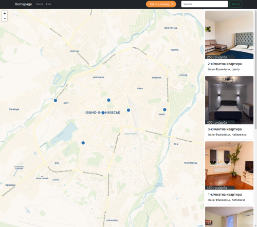
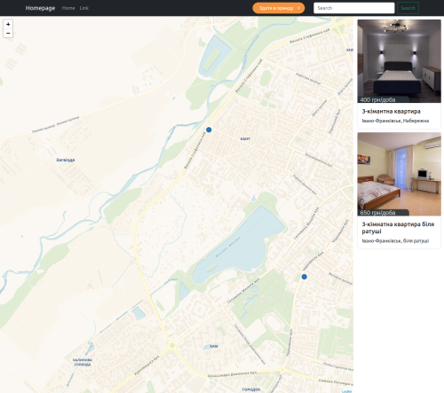
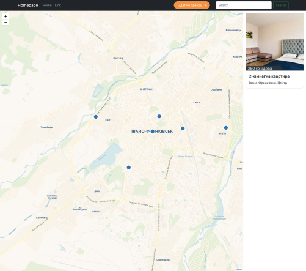
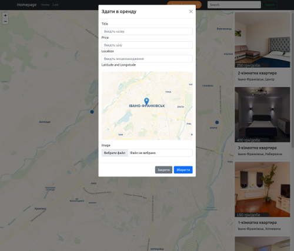

# TEST TASK
## Requirements
> Node version > 16.x

> Python version > 3.8.x

## Instalation libs
Inside project folder:
```
pip install -r requirements.txt
cd frontend
npm i
```

## Run project
Backend:
```
python manage.py runserver
```

Frontend inside folder **Frontend**:
```
npm start
```

## Images
 


